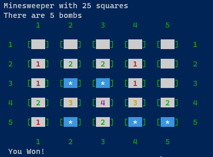
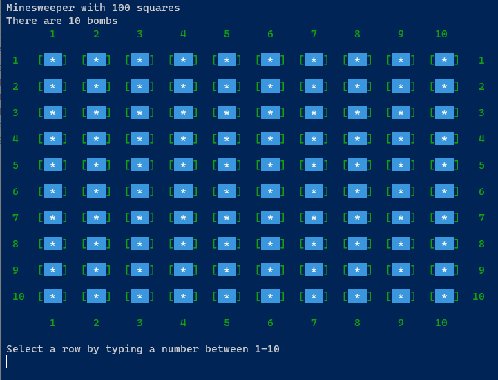
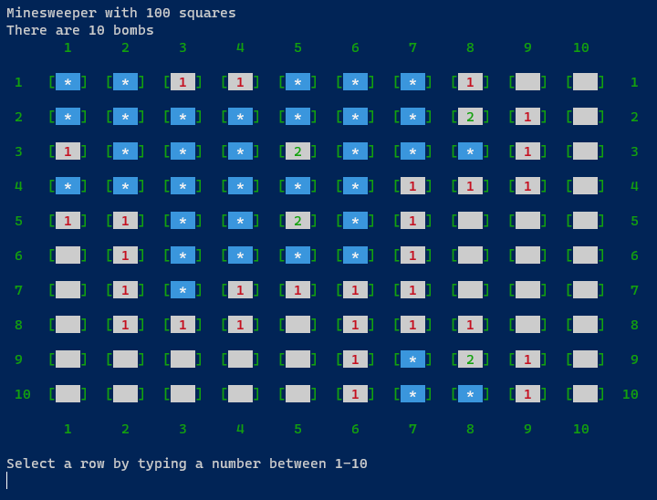
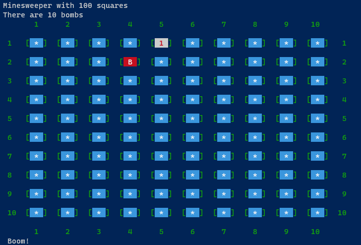

# MineSweeper Java Terminal App



## How To Run
1. Open terminal in main folder (minesweeper-project)
2. Type the following into your terminal
```
java -jar .ms.jar
```


## Images
### Game Started Screen

### Game In Progress

### Game Lost Screen

